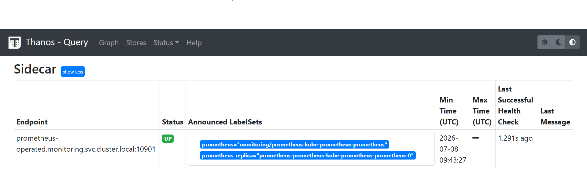

# Enterprise Kubernetes Metrics Pipeline: Prometheus + Thanos

## 📖 Overview
This repository contains the Infrastructure as Code (IaC) and configuration files to deploy a highly available, distributed metrics pipeline on Kubernetes. It utilizes the **kube-prometheus-stack**, injects a **Thanos Sidecar**, and routes metrics to a **Thanos Querier** and **MinIO** object storage.

## ❓ The "Why": Engineering Problem & Solution
Standard Prometheus deployments face three major architectural limitations in enterprise environments:
1. **Ephemeral/Expensive Storage:** Prometheus relies on local block storage (TSDB). Storing years of metrics becomes prohibitively expensive, and disk corruption leads to data loss.
2. **No Global View:** In multi-cluster environments, engineers must query isolated Prometheus instances individually.
3. **HA Deduplication:** Running multiple Prometheus replicas for High Availability results in duplicate, slightly misaligned data points.

**The Thanos Solution:**
By implementing the Sidecar pattern, Thanos solves these issues. The Sidecar uploads TSDB blocks to cheap Object Storage (MinIO/S3) for infinite retention. The Thanos Querier acts as a centralized global gateway, fetching data from all Sidecars via gRPC, and deduplicating HA metrics on the fly before passing them to Grafana.

## 🏗️ Architecture & The "What"
*   **Prometheus Operator:** Automates the deployment and lifecycle of Prometheus.
*   **Thanos Sidecar:** Injected into the Prometheus pod. It shares the local volume, serves metrics via gRPC, and uploads blocks to MinIO.
*   **MinIO:** S3-compatible object storage for Long-Term Storage (LTS) of metrics.
*   **Thanos Querier:** A stateless query engine that aggregates data from the Sidecar and MinIO.
*   **Grafana:** The visualization layer, provisioned to treat Thanos as its primary Prometheus data source.

## ⚙️ The "How": Implementation Details

### 1. Sidecar Injection (`prom-values.yaml`)
Deployed the `kube-prometheus-stack` via Helm, modifying the Custom Resource Definition (CRD) to inject the Thanos Sidecar directly into the Prometheus pod. This establishes the shared volume required for the Sidecar to read Prometheus's TSDB.

### 2. Object Storage Configuration (`thanos-storage.yaml`)
Created Kubernetes Secrets to securely pass MinIO (S3) credentials to the Thanos Sidecar, enabling the automatic upload of 2-hour metric blocks for long-term retention.

### 3. gRPC Service Discovery & Querier (`thanos-values.yaml`)
Deployed the Thanos Querier and manually configured its `--store` flag to target the Prometheus Operator's headless service (`prometheus-operated.monitoring.svc.cluster.local:10901`). This established the critical gRPC tunnel between the Querier and the Sidecar.

### 4. Grafana Provisioning (`thanos-datasource.yaml`)
Automated Grafana's configuration to bypass the default Prometheus endpoint and instead route all PromQL queries to the Thanos Querier (`http://thanos-query.monitoring.svc.cluster.local:9090`).

### 5. Application Scraping (`my-apps-monitor.yaml`)
Configured a `ServiceMonitor` to dynamically discover and scrape custom application metrics, feeding them into the pipeline.

## 🚀 Proof of Concept
The image below demonstrates the successful gRPC connection. The Thanos Querier has successfully discovered the Prometheus Sidecar on port `10901` and reports a healthy **UP** status, proving the metrics tunnel is fully operational.

## 🛠️ Challenges Overcome
During the deployment of this pipeline, several real-world infrastructure challenges were navigated:
*   **Docker Hub Rate Limiting:** Overcame `TooManyRequests` and `ImagePullBackOff` errors by dynamically re-routing Helm charts to utilize alternative enterprise registries (`quay.io` and `mirror.gcr.io`).
*   **Bitnami Security Policies:** Bypassed strict image validation blocks (`global.security.allowInsecureImages=true`) to allow pulling from backup registries.
*   **gRPC Networking:** Debugged Kubernetes service discovery to identify the exact headless service (`prometheus-operated`) generated by the Operator to successfully wire the Thanos Querier to the Sidecar.
